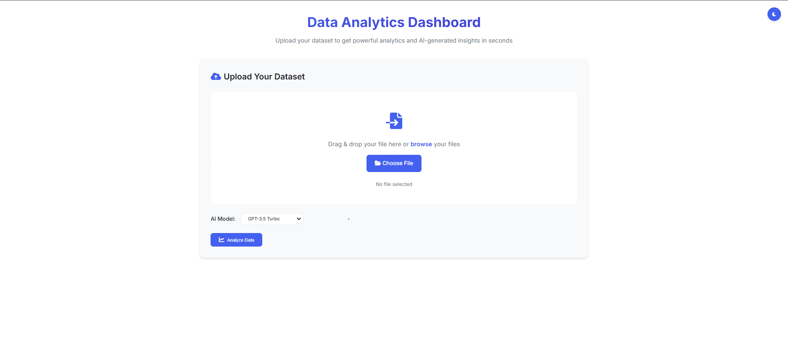
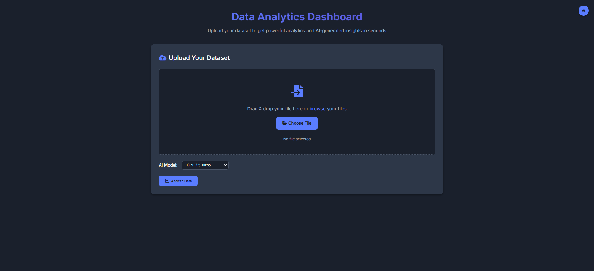
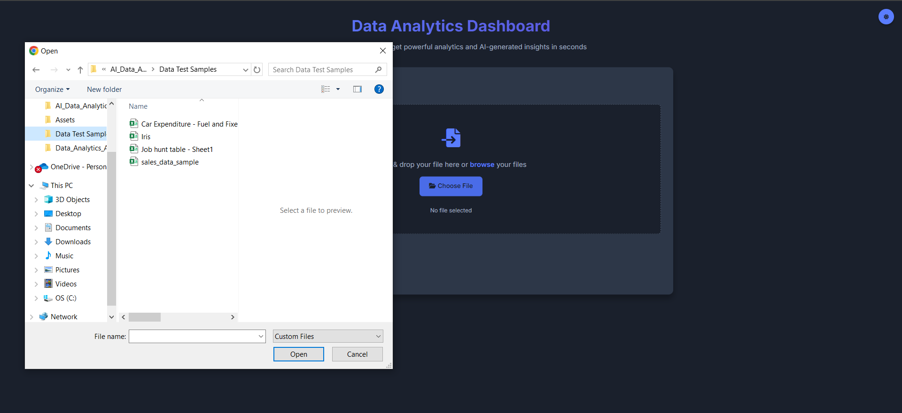
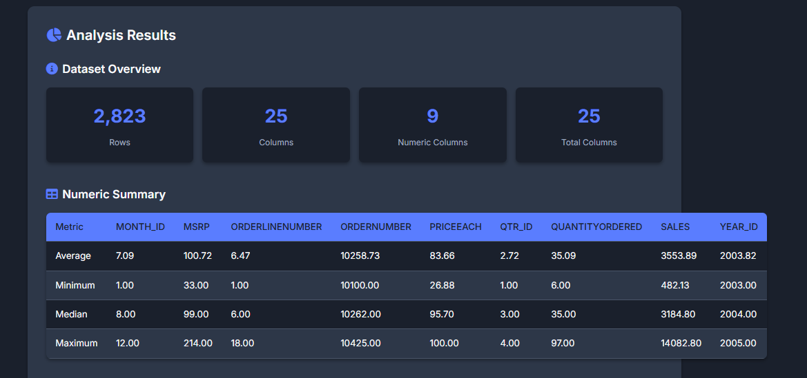
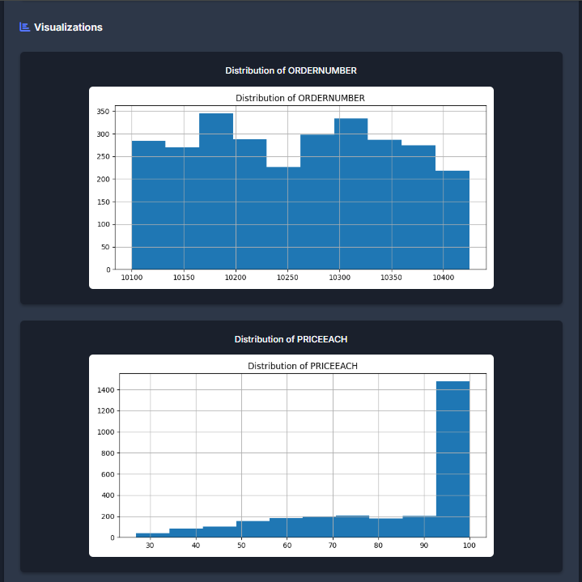
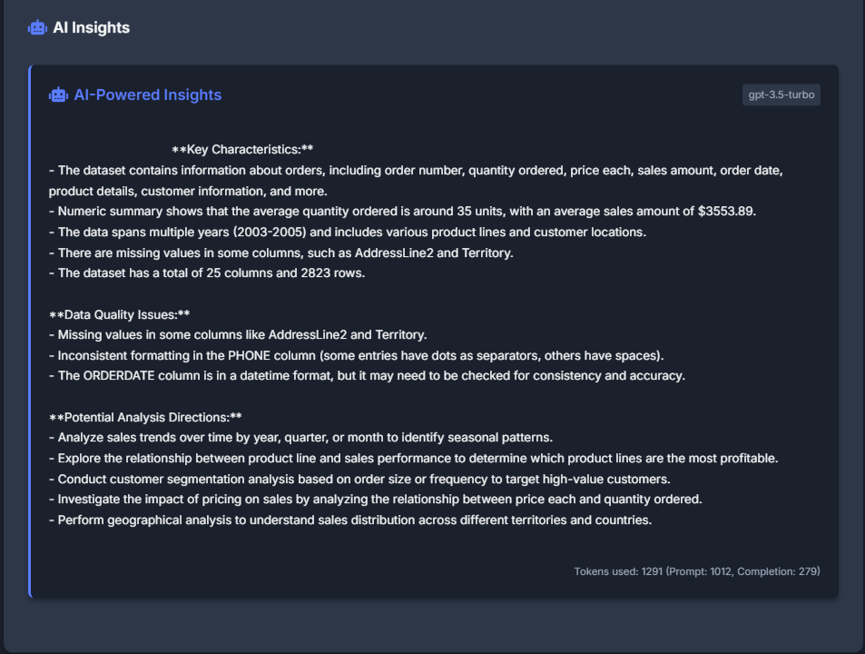

# 📊 Data Analytics Dashboard with AI Insights

A Flask-powered web app for instant data analysis, visualisations, and AI-generated insights — upload a dataset and uncover hidden stories in your data effortlessly.



---

## 🚀 Features

- **📂 Upload CSV or Excel files (max 5MB)**
- **📈 Auto-generated data analysis**
- **📊 Automatic visualisations**
- **🧠 AI-powered data insights**
- **🌓 Responsive UI with Dark/Light mode**
- **🔒 Local database for logging**

---

## 🗂️ Project Structure

```text
├── app.py                  # Main Flask app
├── analytics.db            # SQLite database for logging
├── uploads/                # Uploaded datasets
├── Assets/                 # Image assets (screenshots)
│   ├── Example1.PNG
│   ├── Example2.PNG
│   ├── Example3.PNG
│   ├── Example4.PNG
│   ├── Example5.PNG
│   └── Example6.PNG
├── static/                 # Frontend assets
│   ├── css/
│   │   └── styles.css
│   └── js/
│       └── script.js
├── templates/
│   └── index.html          # Main UI template
├── Test_API/
│   └── TestAPI.py          # Separate API testing code
```

---

## 🛠️ Technologies Used

| Layer        | Tech Stack                          |
|--------------|--------------------------------------|
| **Backend**  | Flask, Python, OpenAI API            |
| **Frontend** | HTML5, CSS3, JavaScript              |
| **AI**       | OpenAI GPT (gpt-3.5-turbo / gpt-4)    |
| **Data**     | Pandas, Matplotlib                   |
| **Database** | SQLite                               |

---

## ⚙️ Installation

```bash
# 1. Clone the repository
git clone https://github.com/yourusername/data-analytics-dashboard.git
cd data-analytics-dashboard

# 2. Create and activate a virtual environment
python -m venv venv
source venv/bin/activate     # On Windows use venv\Scripts\activate

# 3. Install dependencies
pip install -r requirements.txt

# 4. Add your OpenAI API key
echo "OPENAI_API_KEY=your-openai-key-here" > .env
```

---

## ▶️ Usage

```bash
python app.py
```

Visit: [http://localhost:5000](http://localhost:5000)

Upload your file → See instant analysis → Explore AI insights.

---

## 🔌 API Endpoints

| Endpoint     | Method | Description            |
|--------------|--------|------------------------|
| `/`          | GET    | Landing page            |
| `/upload`    | POST   | Upload and process file |

---


## 📦 Requirements

```txt
flask
flask-cors
pandas
openai
matplotlib
python-dotenv
```

---

## 📸 Screenshots

### 🖥️ Landing Page / Dashboard UI
Showcasing the clean, responsive initial UI with options to upload files and toggle between Dark/Light Mode.



---

### 📂 File Upload Interface
Demonstrates where users can select and upload their CSV or Excel datasets easily.



---

### 📑 Data Summary Output
Displays automatic generation of dataset stats: row count, column count, missing values, and data types.



---

### 📊 Visualisations
Shows histograms (or other plots) automatically created for numeric columns — all labeled and readable.



---

### 🧠 AI-Generated Insights
Highlights GPT-powered section where the app generates data quality assessments and analysis recommendations.



---
